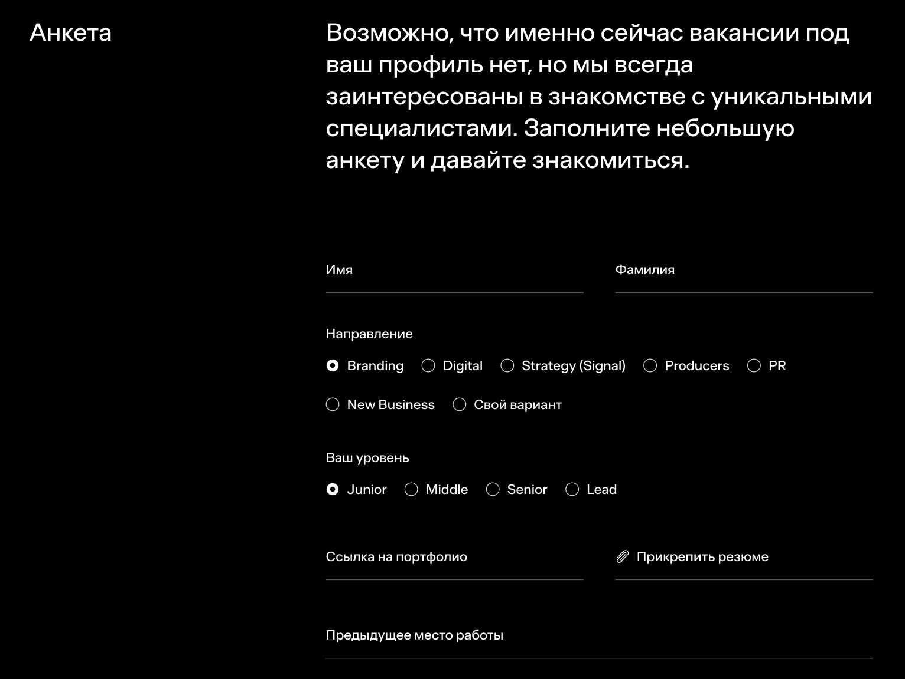

# ONY Career Page

Карьерная страница digital-агентства **ONY**, созданная как часть корпоративного сайта.  
Разработана с акцентом на UX, плавные анимации и быструю загрузку при высокой визуальной насыщенности.

---

## 🌐 Ссылки

- [Ссылка на прод всего сайта](https://ony.ru/)
- [Ссылка на прод карьерной страницы](https://join.ony.ru/)
- [Исходный код хранится в приватном репозитории. Доступ по запросу](https://github.com/Yaroslav-Chertov/ony-agency)

---

## 🖼 Скриншоты





---

## 🎯 Описание и функциональность

Карьерная страница содержит информацию о компании, ценностях, команде, преимуществах работы, историях успеха сотрудников и открытых вакансиях.  
Включает форму обратной связи и интеграцию с CRM через Bitrix API.

---

## 💼 Роль и достижения

- Разработал фронтенд страниц с точным соблюдением **Pixel Perfect** и адаптивной версткой.
- Внедрил **SSR** (server-side rendering) с подстановкой динамического контента из **Bitrix API**, что повысило **SEO** и ускорило первичную загрузку страницы.
- Реализовал плавные анимации и слайдеры с использованием **Swiper**, обеспечив стабильную работу интерфейса на всех устройствах.
- Настроил оптимизацию загрузки ассетов и ленивую подгрузку изображений.
- Участвовал в **код-ревью**, улучшая читаемость и производительность проекта.

---

## 🧠 Технические особенности

- Реализована **система сборки** через Gulp и Esbuild, обеспечивающая быструю компиляцию и минимизацию кода.
- Используется **jtsx-loader** — легковесный шаблонизатор для JSX без использования React.
- Весь JSX-код исполняется на стороне клиента, что обеспечивает гибкость при внедрении SSR.
- Оптимизирована структура анимаций, чтобы минимизировать нагрузку на DOM при высокой плотности графики.

---

## ⚙️ Стек технологий

**JSX Loader (SSR)**, **Node.js**, **SCSS**, **Eslint**, **Gulp**, **Swiper**

---

## 🚀 Требования

Для запуска и компиляции требуется **Node.js 20.15.1** и выше.  
Проект разработан и протестирован на версии **22.14.0**.

---

## 📦 Установка зависимостей

```bash
npm i
```

---

## 🧩 Запуск

```bash
npm run start
```
> Откроет страницу с адресом дев-сервера в новой вкладке.

```bash
npm run dev
```
> Запуск без открытия вкладки.

---

## 🏗️ Компиляция для продакшена

```bash
npm run build
```
> Скомпилирует проект в режиме production независимо от настроек `.env`.

---

## 🌍 Деплой на продакшен

После компиляции загрузить папку `_build` на сервер.  
В ней содержатся все необходимые ассеты и файл `index.html`.  
Сайт реализован как **SPA**, весь HTML рендерится после загрузки страницы с помощью JS.

---

## ⚡ .env параметры

Можно задать параметры запуска и компиляции проекта, создав файл `.env`:

```bash
PORT=8080             # порт, на котором будет запущен проект
NODE_ENV=development  # или production
BUILD_FOLDER=_build   # папка для сборки (по умолчанию _build)
```

> ⚠️ Не указывайте путь `./` — иначе при сборке будет очищена папка с исходным кодом.

---

## 📁 Структура проекта

- `.dev` — вспомогательные инструменты для разработки
- `_build` — финальная сборка (html, css, js, изображения, видео)
- `js` — исходные JS файлы
- `styles` — SCSS стили
- `components` — компоненты интерфейса
- `layouts` — обертки страниц
- `pages` — страницы проекта, компилируемые в `_build/{page}/index.html`
- `public` — статичные файлы (копируются при сборке)
- `node_modules` — зависимости проекта

---

## 🧾 Общие сведения

Проект реализован с упором на производительность, адаптивность и масштабируемость.  
Используется строгий линтинг кода (**Eslint**) и единые код-гайды.  
Кодовая база оптимизирована для расширения — каждый модуль можно использовать повторно в других проектах агентства.

---

